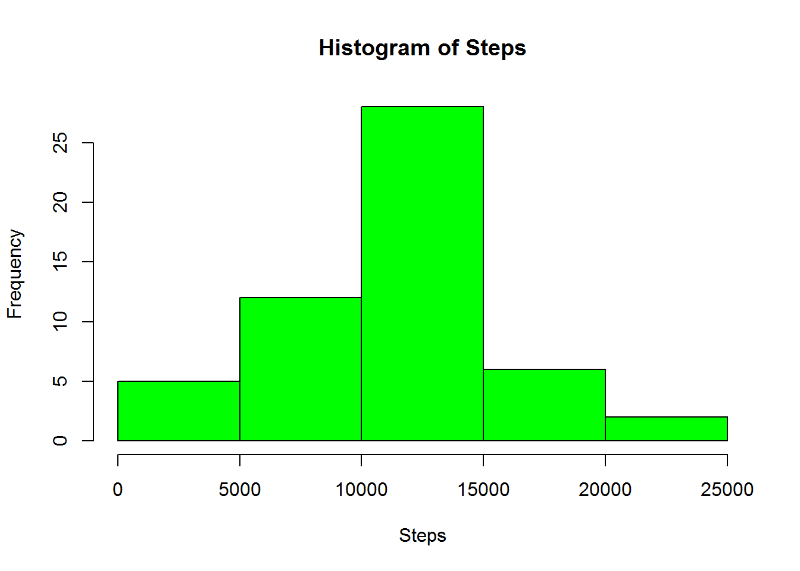
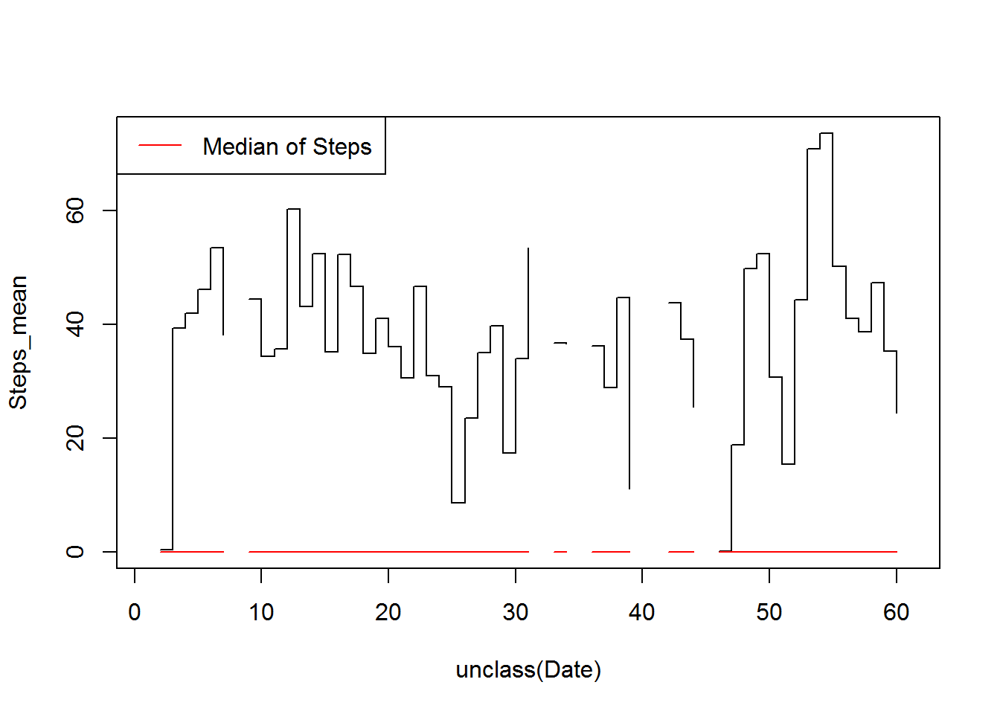
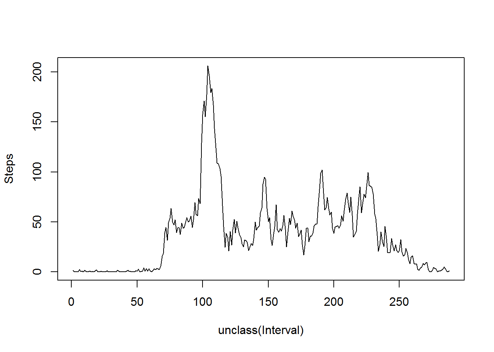
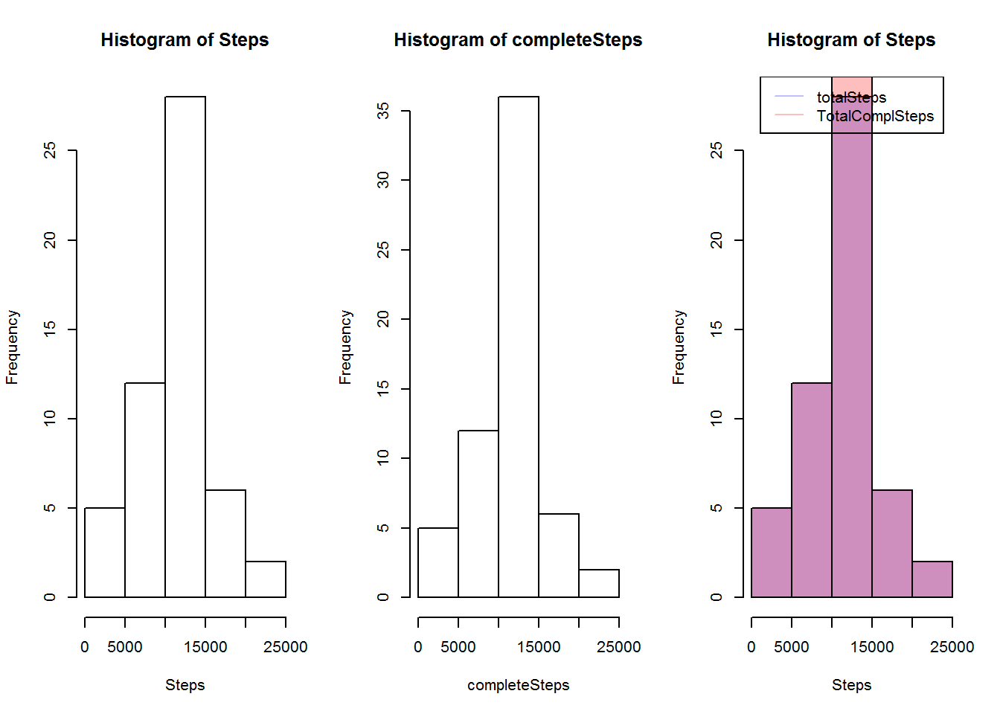
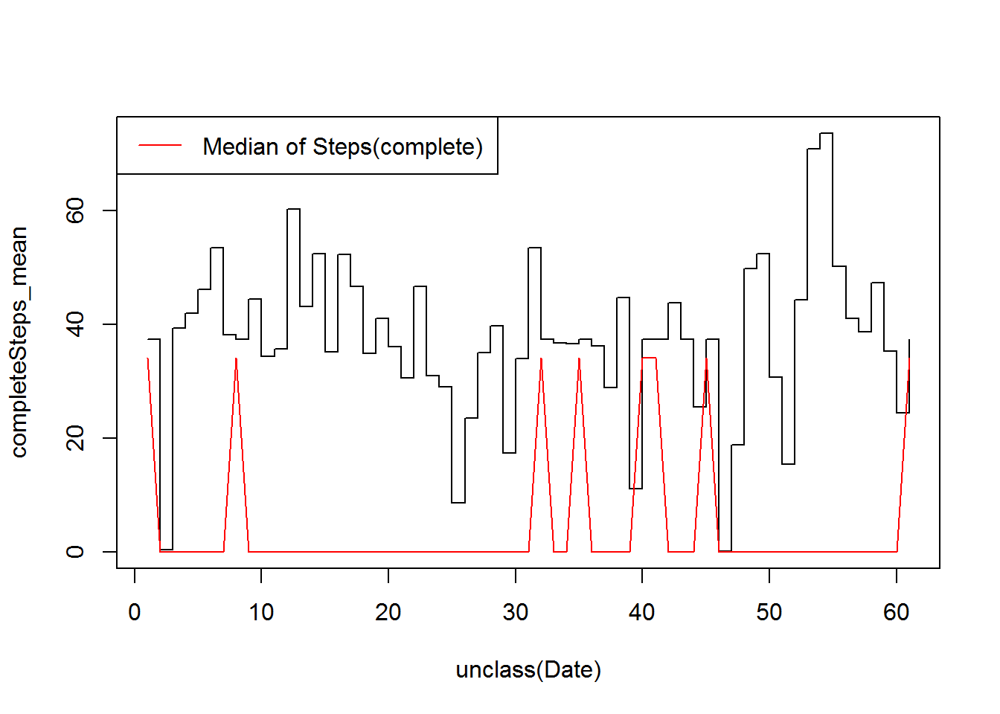
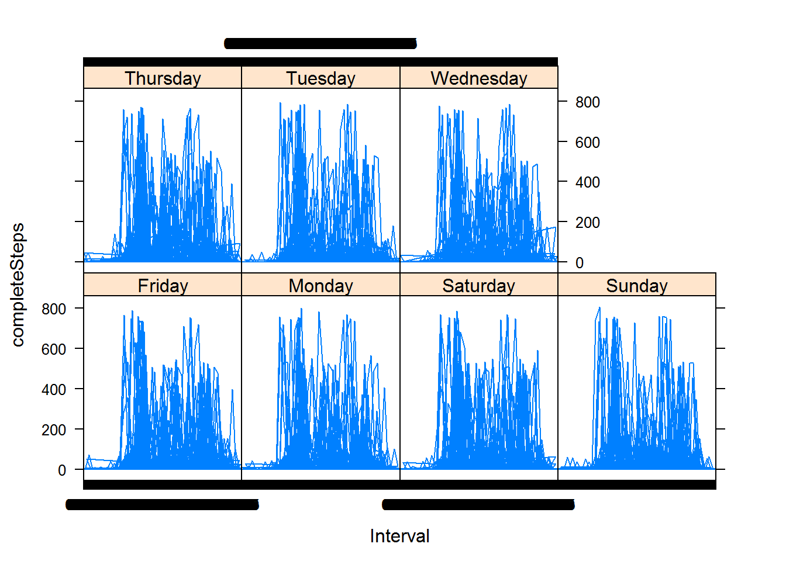

Reproducible Research  
=======================

Coursera - Data Science Specialisation - John Hopkins University  

## Peer Assessment 1

### The Raw Data  

The raw data has been downloaded from the course web site:

- Dataset: [Activity Monitoring Data](https://d396qusza40orc.cloudfront.net/repdata%2Fdata%2Factivity.zip). 

The variables included in this dataset are:

- **steps**: Number of steps taking in a 5-minute interval (missing values are coded as NA)  
- **date**: The date on which the measurement was taken in YYYY-MM-DD format
- **interval**: Identifier for the 5-minute interval in which measurement was taken  
  
The dataset is stored in a comma-separated-value (CSV) file and there are a total of 17,568 observations in this dataset.  

### Loading and processing the data

After setting an empty working directory, the zip file gets downloaded and unzipped , then the files in the working directory are listed.

```r
url1 <- "http://d396qusza40orc.cloudfront.net/repdata%2Fdata%2Factivity.zip"  
download.file(url1, "activityData.zip", mode="wb") 
unzip("activity.zip", overwrite=T)
```

```
## Warning: error 1 in extracting from zip file
```

```r
list.files()
```

```
## [1] "activity.csv"        "activityData.zip"    "DocumentName_cache" 
## [4] "DocumentName_figure" "PA1_template.html"   "PA1_template.md"    
## [7] "PA1_template.Rmd"    "raw_code.R"
```

As it can see in the list, the zip file only contained one large file, the `activity.csv`. What is going to be loaded into r.   


```r
actData <- read.csv("activity.csv", header=T, na.strings="NA", colClasses=c("numeric", "Date", "numeric"))
```


Than the dataset gets processed, just to make it tidyer a tiny bit. A proper Date format column called `Date-Time` is added, the date column kept, but turn it to a factor, same with the `interval` column, after reshaping it to a human readable format.

First I get a vector of long characterstrings(4-7 chars long) from `actData$interval`. Then I substract the last four character of these long characterstring with the `getLast4Char` function.


```r
rawTime <- paste("000", actData$interval, sep="")

getLast4Char <- function(x) {
        substr(x, nchar(x)-3, nchar(x))
}

blueTime <- c()
for(i in 1:length(rawTime)) {
        blueTime <- c(blueTime, getLast4Char(rawTime[i]), recursive=T)
}
head(blueTime)
```

```
## [1] "0000" "0005" "0010" "0015" "0020" "0025"
```

After this,the `time` vector is created, which contains five character long strings in the format of `HH:MM`


```r
rareTime1 <- c()
for(i in 1:length(blueTime)) {
        rareTime1 <- c(rareTime1, substr(blueTime[i], 1, 2), recursive=T)
        }
rareTime2 <- c()
for(i in 1:length(blueTime)) {
        rareTime2 <- c(rareTime2, substr(blueTime[i], 3, 4), recursive=T)
}
time <- paste(rareTime1, rareTime2, sep=":", collapse=NULL)
head(time)
```

```
## [1] "00:00" "00:05" "00:10" "00:15" "00:20" "00:25"
```

Then the `time` vector is pasted with the `date` column from the `actData` dataset and turned it into a proper date format.  

After this the final tidy dataset, called `activityData`, are created. It contains 4 column: `Date_Time`, what has just been created, `Date` factorised from the original dataset, `Interval`, factorised from the original dataset and finally the `Steps` column from the original dataset. 


```r
dateTime <- paste(actData$date, time, sep=" ")
dateTime <- strptime(dateTime, format="%F %H:%M")

activityData <- data.frame(dateTime, as.factor(actData$date), as.factor(time), actData$steps)

names(activityData) <- c("Date_Time", "Date", "Interval", "Steps")
summary(activityData)
```

```
##    Date_Time                           Date          Interval    
##  Min.   :2012-10-01 00:00:00   2012-10-01:  288   00:00  :   61  
##  1st Qu.:2012-10-16 05:58:45   2012-10-02:  288   00:05  :   61  
##  Median :2012-10-31 11:57:30   2012-10-03:  288   00:10  :   61  
##  Mean   :2012-10-31 11:30:52   2012-10-04:  288   00:15  :   61  
##  3rd Qu.:2012-11-15 17:56:15   2012-10-05:  288   00:20  :   61  
##  Max.   :2012-11-30 23:55:00   2012-10-06:  288   00:25  :   61  
##                                (Other)   :15840   (Other):17202  
##      Steps      
##  Min.   :  0.0  
##  1st Qu.:  0.0  
##  Median :  0.0  
##  Mean   : 37.4  
##  3rd Qu.: 12.0  
##  Max.   :806.0  
##  NA's   :2304
```

### What is mean total number of steps taken per day?

For this part of the analysis,missing values are ignored in the dataset.

**Total number of steps taken each day**


Before making a histogram of the total number of steps taken each they, the `activityData` dataset has to be melt and cast with the help of the `reshape` library created by Hadley Wickham.


```r
library(reshape)

totalSteps <- cast(melt(activityData[,c(2,4)], id="Date"), Date~variable, sum)
summary(totalSteps)
```

```
##          Date        Steps      
##  2012-10-01: 1   Min.   :   41  
##  2012-10-02: 1   1st Qu.: 8841  
##  2012-10-03: 1   Median :10765  
##  2012-10-04: 1   Mean   :10766  
##  2012-10-05: 1   3rd Qu.:13294  
##  2012-10-06: 1   Max.   :21194  
##  (Other)   :55   NA's   :8
```

Then the plot are drawn in the base plotting system in R.


```r
with(totalSteps, hist(Steps, col="green"))
```

 

**Calculate and report the mean and median total number of steps taken per day**

First,  the `activityData` dataset is reshaped to the `meanSteps` and `medianSteps` dataset, then the last two datasets are merged into one dataset called `averageSteps` .


```r
meanSteps <- cast(melt(activityData[,c(2,4)], id="Date"), Date~variable, mean)
medianSteps <- cast(melt(activityData[,c(2,4)], id="Date"), Date~variable, median)

averageSteps <- merge(meanSteps, medianSteps, by="Date", suffixes=c("_mean", "_median"))
summary(averageSteps)
```

```
##          Date      Steps_mean     Steps_median
##  2012-10-01: 1   Min.   : 0.14   Min.   :0    
##  2012-10-02: 1   1st Qu.:30.70   1st Qu.:0    
##  2012-10-03: 1   Median :37.38   Median :0    
##  2012-10-04: 1   Mean   :37.38   Mean   :0    
##  2012-10-05: 1   3rd Qu.:46.16   3rd Qu.:0    
##  2012-10-06: 1   Max.   :73.59   Max.   :0    
##  (Other)   :55   NA's   :8       NA's   :8
```

After this, a plot is drawn to help interpreting the data


```r
with(averageSteps, plot(unclass(Date), Steps_mean, type="s"))
lines(unclass(averageSteps$Date), averageSteps$Steps_median, col="red")        
legend("topleft", legend="Median of Steps", lty=1, col="red")
```

 

**What is the average daily activity pattern?**


 To illustrate the average daily activity patten, the `activityDate` dataset has to be melt and cast .
 

```r
intervalSteps <- cast(melt(activityData[,3:4], id="Interval"), Interval~variable, mean, na.rm=T)
summary(intervalSteps)
```

```
##     Interval       Steps       
##  00:00  :  1   Min.   :  0.00  
##  00:05  :  1   1st Qu.:  2.49  
##  00:10  :  1   Median : 34.11  
##  00:15  :  1   Mean   : 37.38  
##  00:20  :  1   3rd Qu.: 52.83  
##  00:25  :  1   Max.   :206.17  
##  (Other):282
```

Then a plot showing the average number of steps taken are drawn, averaged across all days.
 

```r
with(intervalSteps, plot(unclass(Interval), Steps, type="l"))
```

 

It can be seen that the max number of steps(206.1698) are taken in the five minutes interval starting at 08:35.

### Imputing missing values

So far the missing values have been ignored. From now on, the missing values are populated. But first, they has to be detected.


```r
a <- paste("NA in Date_Time:",  as.character(sum(is.na(activityData$Date_Time))))
b <- paste("NA in Date:",  as.character(sum(is.na(activityData$Date))))
c <- paste("NA in Interval:",  as.character(sum(is.na(activityData$Interval))))
d <- paste("NA in Steps:",  as.character(sum(is.na(activityData$Steps))))
print(a)
```

```
## [1] "NA in Date_Time: 0"
```

```r
print(b)
```

```
## [1] "NA in Date: 0"
```

```r
print(c)
```

```
## [1] "NA in Interval: 0"
```

```r
print(d)
```

```
## [1] "NA in Steps: 2304"
```

It can bee seen, not so surprisingly, that missing values are only found in the 
`Steps` column of `activityDataset`.  
  
The next step is to identify their position.

```r
missingValues <- which(is.na(activityData$Steps))
```

After identifying the position of the missing values, they are filled in with the number of averege steps taken from the approriat interval.

First the appropriate values are collected into the `fillers` vector.

```r
fillers <- c()
for(i in 1:length(missingValues)) {
        fillers <- c(fillers, intervalSteps$Steps[intervalSteps$Interval==activityData$Interval[missingValues[i]]])
}
summary(fillers)
```

```
##    Min. 1st Qu.  Median    Mean 3rd Qu.    Max. 
##    0.00    2.49   34.10   37.40   52.80  206.00
```

Then, the values from the `fillers` are filled into a new vector called `completeSteps`


```r
completeSteps <-activityData$Steps
counter <- 0
for(i in 1:length(missingValues)) {
        counter <- counter + 1
        completeSteps[missingValues[i]] <- fillers[counter]
}
summary(completeSteps)
```

```
##    Min. 1st Qu.  Median    Mean 3rd Qu.    Max. 
##     0.0     0.0     0.0    37.4    27.0   806.0
```

```r
sum(is.na(completeSteps))
```

```
## [1] 0
```

```r
length(completeSteps)
```

```
## [1] 17568
```

After this a new dataset is created, called `complActDat`, with the same structure as the `activityData`, except its last column is the `completeSteps` vector.  
  

```r
complActDat <- data.frame(activityData[,1:3], completeSteps)
summary(complActDat)
```

```
##    Date_Time                           Date          Interval    
##  Min.   :2012-10-01 00:00:00   2012-10-01:  288   00:00  :   61  
##  1st Qu.:2012-10-16 05:58:45   2012-10-02:  288   00:05  :   61  
##  Median :2012-10-31 11:57:30   2012-10-03:  288   00:10  :   61  
##  Mean   :2012-10-31 11:30:52   2012-10-04:  288   00:15  :   61  
##  3rd Qu.:2012-11-15 17:56:15   2012-10-05:  288   00:20  :   61  
##  Max.   :2012-11-30 23:55:00   2012-10-06:  288   00:25  :   61  
##                                (Other)   :15840   (Other):17202  
##  completeSteps  
##  Min.   :  0.0  
##  1st Qu.:  0.0  
##  Median :  0.0  
##  Mean   : 37.4  
##  3rd Qu.: 27.0  
##  Max.   :806.0  
## 
```

### Comparison of the estimated and the complete dataset.

**Total number of steps a day**

The `totalComplSteps` dataset is created in the same way as the `totalSteps` dataset.


```r
totalComplSteps <- cast(melt(complActDat[,c(2,4)], id="Date"), Date~variable, sum)
summary(totalComplSteps)
```

```
##          Date    completeSteps  
##  2012-10-01: 1   Min.   :   41  
##  2012-10-02: 1   1st Qu.: 9819  
##  2012-10-03: 1   Median :10766  
##  2012-10-04: 1   Mean   :10766  
##  2012-10-05: 1   3rd Qu.:12811  
##  2012-10-06: 1   Max.   :21194  
##  (Other)   :55
```


Then the histograms were created along with the comparing histogram.


```r
par(mfrow=c(1,3))
p1 <- with(totalSteps, hist(Steps))                  
p2 <- with(totalComplSteps, hist(completeSteps))                  
plot( p1, col=rgb(0,0,1,1/4)) 
plot( p2, col=rgb(1,0,0,1/4), add=T)
legend("top", legend=c("totalSteps", "TotalComplSteps"), lty=1, col=c(rgb(0,0,1,1/4), rgb(1,0,0,1/4)))
```

 

**Mean and median of steps taken per day**


```r
complMeanSteps <- cast(melt(complActDat[,c(2,4)], id="Date"), Date~variable, mean)
complMedianSteps <- cast(melt(complActDat[,c(2,4)], id="Date"), Date~variable, median)
complAverageSteps <- merge(complMeanSteps, complMedianSteps, by="Date", suffixes=c("_mean", "_median"))
summary(complAverageSteps)
```

```
##          Date    completeSteps_mean completeSteps_median
##  2012-10-01: 1   Min.   : 0.14      Min.   : 0.00       
##  2012-10-02: 1   1st Qu.:34.09      1st Qu.: 0.00       
##  2012-10-03: 1   Median :37.38      Median : 0.00       
##  2012-10-04: 1   Mean   :37.38      Mean   : 4.47       
##  2012-10-05: 1   3rd Qu.:44.48      3rd Qu.: 0.00       
##  2012-10-06: 1   Max.   :73.59      Max.   :34.11       
##  (Other)   :55
```

```r
with(averageSteps, plot(unclass(Date), Steps_mean, type="s"))
lines(unclass(averageSteps$Date), averageSteps$Steps_median, col="red")        
legend("topleft", legend="Median of Steps", lty=1, col="red")
```

 

```r
with(complAverageSteps, plot(unclass(Date), completeSteps_mean, type="s"))
lines(unclass(complAverageSteps$Date), complAverageSteps$completeSteps_median, col="red")        
legend("topleft", legend="Median of Steps(complete)", lty=1, col="red")
```

 


As it can be seen the total and the mean values do not differ, but the median has changed, as the filler values were gained from the mean of the intervals across the day, therefore it has unskewed the distribution. 

### Are there differences in activity patterns between weekdays and weekends?


```r
data3 <- data.frame(cbind(complActDat, weekdays(complActDat$Date_Time)))
summary(data3)
```

```
##    Date_Time                           Date          Interval    
##  Min.   :2012-10-01 00:00:00   2012-10-01:  288   00:00  :   61  
##  1st Qu.:2012-10-16 05:58:45   2012-10-02:  288   00:05  :   61  
##  Median :2012-10-31 11:57:30   2012-10-03:  288   00:10  :   61  
##  Mean   :2012-10-31 11:30:52   2012-10-04:  288   00:15  :   61  
##  3rd Qu.:2012-11-15 17:56:15   2012-10-05:  288   00:20  :   61  
##  Max.   :2012-11-30 23:55:00   2012-10-06:  288   00:25  :   61  
##                                (Other)   :15840   (Other):17202  
##  completeSteps   weekdays.complActDat.Date_Time.
##  Min.   :  0.0   Friday   :2592                 
##  1st Qu.:  0.0   Monday   :2592                 
##  Median :  0.0   Saturday :2304                 
##  Mean   : 37.4   Sunday   :2304                 
##  3rd Qu.: 27.0   Thursday :2592                 
##  Max.   :806.0   Tuesday  :2592                 
##                  Wednesday:2592
```

```r
library(lattice)
xyplot(completeSteps ~ Interval | c("Monday", "Tuesday", "Wednesday", "Thursday", "Friday", "Saturday", "Sunday"), data3, type="l")
```

 
